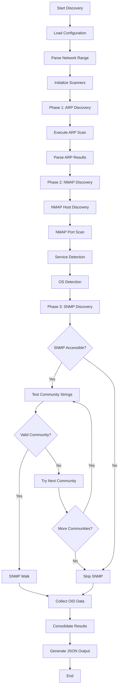
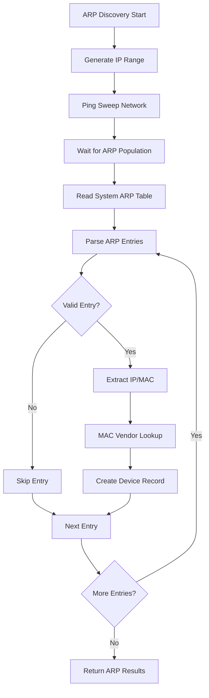
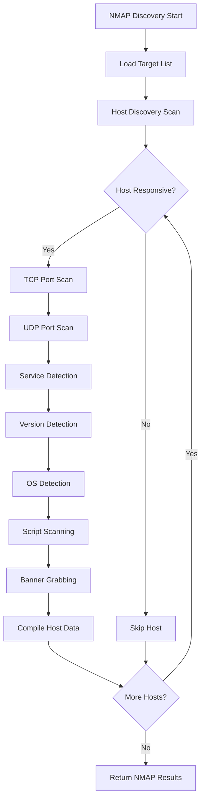
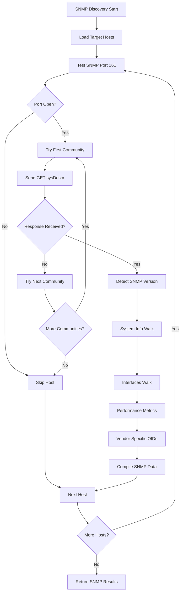
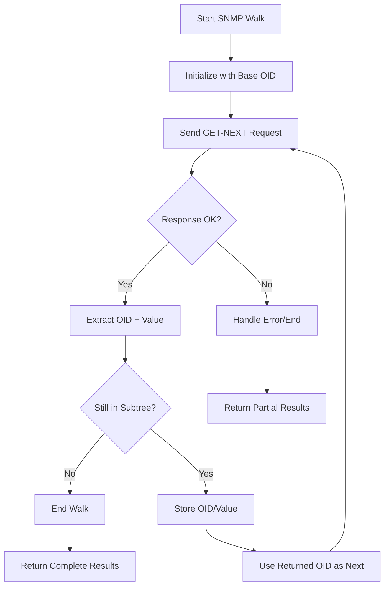

# Specifiche e Design - Modulo Discovery Engine

## 1. Panoramica del Modulo Discovery

### 1.1 Obiettivo
Il modulo Discovery Engine è responsabile dell'identificazione automatica di dispositivi di rete e della raccolta di informazioni dettagliate tramite protocolli ARP, NMAP e SNMP (v1/v2c), producendo un output JSON strutturato.

### 1.2 Output Finale
Il modulo genera un file JSON contenente:
- Lista completa dispositivi scoperti
- Servizi attivi per ogni dispositivo
- Metriche SNMP quando disponibili
- Metadata di discovery (timestamp, metodi utilizzati)

## 2. Protocolli Utilizzati - Analisi Dettagliata

### 2.1 Address Resolution Protocol (ARP)

#### 2.1.1 Funzionamento Tecnico
ARP opera a livello 2 (Data Link) del modello OSI per mappare indirizzi IP a indirizzi MAC.

**Meccanismo di Discovery:**
1. **ARP Request Broadcast**: Invio di pacchetti ARP request in broadcast (FF:FF:FF:FF:FF:FF)
2. **ARP Reply Analysis**: Analisi delle risposte per identificare dispositivi attivi
3. **ARP Table Parsing**: Lettura della tabella ARP locale del sistema

**Struttura Pacchetto ARP:**
```
Hardware Type (2 bytes) | Protocol Type (2 bytes)
Hardware Length (1 byte) | Protocol Length (1 byte)
Operation (2 bytes) | Sender MAC (6 bytes)
Sender IP (4 bytes) | Target MAC (6 bytes)
Target IP (4 bytes)
```

**Vantaggi:**
- Velocità elevata (operazioni locali)
- Basso overhead di rete
- Non bloccato da firewall standard

**Limitazioni:**
- Solo dispositivi nella stessa subnet
- Non fornisce informazioni sui servizi
- Dipendente dalla tabella ARP locale

#### 2.1.2 Implementazione Discovery
1. **Ping Sweep**: Ping su tutti gli IP del range per popolare ARP table
2. **ARP Table Read**: Lettura `/proc/net/arp` (Linux) o `arp -a` (Windows)
3. **MAC Vendor Lookup**: Identificazione vendor tramite OUI database

### 2.2 Network Mapper (NMAP)

#### 2.2.1 Funzionamento Tecnico
NMAP utilizza multiple tecniche di scanning per identificare host e servizi.

**Tipi di Scan Host Discovery:**

**A. ICMP Echo Scan (-sn)**
- Invio ICMP Echo Request (ping)
- Analisi ICMP Echo Reply
- Bypass firewall con ICMP Timestamp/Address Mask

**B. TCP SYN Scan (-sS)**
- Invio TCP SYN su porte comuni (80, 443, 22, 23)
- Analisi SYN-ACK (porta aperta) vs RST (porta chiusa)
- Stealth scan (non completa handshake)

**C. TCP Connect Scan (-sT)**
- Handshake TCP completo
- Maggiore affidabilità ma più rilevabile
- Utilizzato quando SYN scan non disponibile

**Tipi di Scan Porte:**

**A. TCP SYN Stealth Scan (-sS)**
```
Client → Server: SYN
Server → Client: SYN-ACK (porta aperta) / RST (porta chiusa)
Client → Server: RST (termina senza completare)
```

**B. UDP Scan (-sU)**
- Invio pacchetti UDP vuoti
- Nessuna risposta = porta aperta|filtrata
- ICMP Port Unreachable = porta chiusa
- Risposta UDP = porta aperta

**C. Service Version Detection (-sV)**
- Connessione alle porte aperte
- Invio probe specifici per servizio
- Pattern matching su banner/risposte

#### 2.2.2 OS Detection (-O)
**Tecniche utilizzate:**
- **TCP ISN Sampling**: Analisi Initial Sequence Number
- **TCP Options**: Analisi opzioni TCP header
- **Window Size**: Pattern di dimensioni finestra TCP
- **ICMP Response**: Analisi risposte ICMP
- **UDP Response**: Comportamento porte UDP chiuse

### 2.3 Simple Network Management Protocol (SNMP v1/v2c)

#### 2.3.1 Architettura SNMP
SNMP opera su modello manager-agent:
- **Manager**: Applicazione che richiede informazioni
- **Agent**: Daemon sui dispositivi che risponde alle query
- **MIB**: Management Information Base (database informazioni)

#### 2.3.2 Versioni SNMP Supportate

**SNMPv1:**
- Porta: UDP 161 (agent), UDP 162 (trap)
- Autenticazione: Community string (plaintext)
- Operazioni: GET, GET-NEXT, SET, TRAP
- Sicurezza: Nessuna (community string in chiaro)
- Encoding: BER (Basic Encoding Rules)

**SNMPv2c (Community-based):**
- Compatibilità: Backward compatible con v1
- Miglioramenti: BULK operations, miglior error handling
- Autenticazione: Community string (come v1)
- Nuove operazioni: GET-BULK, INFORM
- Data types: Aggiunti Counter64, UInteger32

#### 2.3.3 Object Identifier (OID) Structure
```
iso(1).org(3).dod(6).internet(1).mgmt(2).mib-2(1).system(1).sysDescr(1).0
                                    ↓
                            1.3.6.1.2.1.1.1.0
```

**OID Hierarchy:**
- **iso(1)**: International Organization for Standardization
- **org(3)**: Organization branch
- **dod(6)**: Department of Defense
- **internet(1)**: Internet branch
- **mgmt(2)**: Management branch
- **mib-2(1)**: MIB-II standard objects

**OID Categories:**
- **System Group (1.3.6.1.2.1.1)**: Informazioni di sistema
- **Interfaces Group (1.3.6.1.2.1.2)**: Statistiche interfacce
- **IP Group (1.3.6.1.2.1.4)**: Routing table, ARP table
- **SNMP Group (1.3.6.1.2.1.11)**: Statistiche SNMP

#### 2.3.4 SNMP Operations

**GET Request:**
```
SNMP Message:
  Version: 1 (SNMPv2c)
  Community: "public"
  PDU:
    Type: GET (0)
    Request ID: Unique identifier
    Error Status: 0 (no error)
    Error Index: 0
    Variable Bindings: [OID, NULL]
```

**GET-RESPONSE:**
```
SNMP Message:
  Version: 1
  Community: "public"
  PDU:
    Type: GET-RESPONSE (2)
    Request ID: Same as request
    Error Status: 0 (success)
    Error Index: 0
    Variable Bindings: [OID, Value]
```

**WALK Operation:**
Iterazione sequenziale attraverso MIB tree usando GET-NEXT:
1. GET-NEXT su OID base
2. Riceve OID successivo + valore
3. Ripete fino a fine subtree o errore

**GET-BULK (SNMPv2c only):**
- Efficiente per recuperare multiple OID
- Parametri: non-repeaters, max-repetitions
- Riduce numero di round-trip

#### 2.3.5 SNMP Error Codes
- **noError(0)**: Operazione riuscita
- **tooBig(1)**: Risposta troppo grande
- **noSuchName(2)**: OID non esistente
- **badValue(3)**: Valore non valido per SET
- **readOnly(4)**: Tentativo SET su OID read-only
- **genErr(5)**: Errore generico

## 3. Flowchart Discovery Process

### 3.1 Main Discovery Flow



### 3.2 Detailed ARP Discovery Flow



### 3.3 Detailed NMAP Discovery Flow



### 3.4 Detailed SNMP Discovery Flow



### 3.5 SNMP Walk Process Detail



## 4. Struttura Output JSON

### 4.1 Schema JSON Output

```json
{
  "discovery_metadata": {
    "scan_id": "uuid-12345-67890",
    "timestamp": "2025-08-27T10:30:00Z",
    "network_range": "192.168.1.0/24",
    "scan_duration_seconds": 180,
    "total_devices": 25,
    "scan_methods_used": ["arp", "nmap", "snmp"],
    "configuration_used": "default_config.yml"
  },
  "devices": [
    {
      "ip_address": "192.168.1.1",
      "mac_address": "aa:bb:cc:dd:ee:ff",
      "hostname": "router.local",
      "device_type": "router",
      "vendor": "Cisco",
      "discovery_methods": ["arp", "nmap", "snmp"],
      "response_time_ms": 12,
      "first_seen": "2025-08-27T10:30:15Z",
      "last_seen": "2025-08-27T10:32:45Z",
      "operating_system": {
        "name": "Cisco IOS",
        "version": "15.1",
        "confidence": 95,
        "cpe": "cpe:/o:cisco:ios:15.1"
      },
      "services": [
        {
          "port": 22,
          "protocol": "tcp",
          "service": "ssh",
          "version": "OpenSSH 7.4",
          "state": "open",
          "banner": "SSH-2.0-OpenSSH_7.4",
          "cpe": "cpe:/a:openbsd:openssh:7.4"
        },
        {
          "port": 80,
          "protocol": "tcp",
          "service": "http",
          "version": "Apache httpd 2.4.6",
          "state": "open",
          "banner": "Apache/2.4.6 (CentOS)"
        },
        {
          "port": 161,
          "protocol": "udp",
          "service": "snmp",
          "version": "SNMPv2c",
          "state": "open",
          "community": "public"
        }
      ],
      "snmp_data": {
        "accessible": true,
        "version": "2c",
        "community": "public",
        "system_info": {
          "sysDescr": "Cisco IOS Software, C2960 Software (C2960-LANBASEK9-M), Version 15.1(3)T4",
          "sysUpTime": 123456789,
          "sysUpTimeFormatted": "14 days, 6:56:07.89",
          "sysName": "Router01",
          "sysLocation": "Data Center 1, Rack A5",
          "sysContact": "admin@company.com",
          "sysObjectID": "1.3.6.1.4.1.9.1.716"
        },
        "interfaces": [
          {
            "ifIndex": 1,
            "ifDescr": "GigabitEthernet0/1",
            "ifType": 6,
            "ifMtu": 1500,
            "ifSpeed": 1000000000,
            "ifPhysAddress": "aa:bb:cc:dd:ee:ff",
            "ifAdminStatus": 1,
            "ifOperStatus": 1,
            "ifInOctets": 1234567890,
            "ifOutOctets": 987654321,
            "ifInErrors": 0,
            "ifOutErrors": 0
          }
        ],
        "performance_metrics": {
          "cpu_utilization_5min": 15.5,
          "memory_pool_used": 45.2,
          "memory_pool_free": 54.8,
          "temperature": 42
        },
        "vendor_data": {
          "cisco_specific": {
            "ios_version": "15.1(3)T4",
            "hardware_model": "WS-C2960G-24TC-L",
            "serial_number": "FOC1234ABCD"
          }
        }
      },
      "discovery_details": {
        "arp_discovery": {
          "found": true,
          "method": "arp_table_lookup",
          "timestamp": "2025-08-27T10:30:15Z"
        },
        "nmap_discovery": {
          "host_up": true,
          "scan_duration_ms": 1250,
          "ports_scanned": 100,
          "open_ports": 3,
          "os_detection_confidence": 95
        },
        "snmp_discovery": {
          "accessible": true,
          "community_found": "public",
          "oids_collected": 47,
          "walk_duration_ms": 3400
        }
      }
    }
  ],
  "scan_statistics": {
    "arp_scan": {
      "total_ips_pinged": 254,
      "ping_responses": 25,
      "arp_entries_found": 25,
      "scan_time_seconds": 30,
      "success_rate": 100.0
    },
    "nmap_scan": {
      "total_hosts_targeted": 25,
      "responsive_hosts": 23,
      "total_ports_scanned": 2300,
      "open_ports_found": 156,
      "services_identified": 89,
      "os_fingerprints": 18,
      "scan_time_seconds": 120
    },
    "snmp_scan": {
      "hosts_tested": 23,
      "snmp_responsive": 8,
      "v1_accessible": 3,
      "v2c_accessible": 5,
      "total_oids_collected": 245,
      "communities_tested": ["public", "private", "community"],
      "scan_time_seconds": 30
    }
  },
  "errors": [
    {
      "timestamp": "2025-08-27T10:31:45Z",
      "host": "192.168.1.50",
      "error_type": "snmp_timeout",
      "message": "SNMP timeout after 5 seconds",
      "retry_count": 3
    }
  ]
}
```

## 5. File di Configurazione

### 5.1 Configuration File (config.yml)

```yaml
# Network Discovery Configuration
network:
  # Target network range (CIDR notation)
  target_range: "192.168.1.0/24"
  
  # Additional specific hosts
  additional_hosts:
    - "10.0.0.1"
    - "172.16.0.0/16"
  
  # Exclusions
  exclude_ranges:
    - "192.168.1.100-192.168.1.110"
  
  # DNS servers for hostname resolution
  dns_servers:
    - "8.8.8.8"
    - "1.1.1.1"

# ARP Discovery Settings
arp_discovery:
  enabled: true
  ping_sweep: true
  timeout_seconds: 1
  max_parallel_pings: 50
  ping_count: 1

# NMAP Configuration
nmap:
  enabled: true
  
  # Host discovery options
  host_discovery:
    methods: ["ping", "arp", "syn"]
    timeout: "5s"
    max_rate: 1000
    ping_types: ["icmp", "tcp-syn", "tcp-ack"]
  
  # Port scanning options
  port_scan:
    enabled: true
    scan_type: "syn"  # syn, connect, udp
    
    # Port ranges
    tcp_ports:
      - "1-1000"      # Common ports
      - "3389,5900"   # RDP, VNC
      - "8080,8443"   # Web services
      - "22,23,80,443,21,25,53,110,993,995" # Standard services
    
    udp_ports:
      - "53,161,162,123,69,67,68"  # DNS, SNMP, NTP, TFTP, DHCP
    
    # Performance settings
    timing_template: 4  # 0-5 (paranoid to insane)
    max_parallelism: 100
    timeout: "10s"
    max_retries: 2
  
  # Service detection
  service_detection:
    enabled: true
    version_intensity: 7  # 0-9
    version_light: false
    probe_all_ports: false
    
  # OS detection
  os_detection:
    enabled: true
    aggressive: false
    osscan_limit: true  # Only scan if port scan found at least one open and one closed port
    
  # Script scanning
  scripts:
    enabled: true
    categories: ["default", "safe"]
    custom_scripts: []

# SNMP Configuration (v1/v2c only)
snmp:
  enabled: true
  
  # Connection settings
  port: 161
  timeout_seconds: 5
  retries: 3
  max_parallel: 20
  
  # Protocol versions to try
  versions: ["2c", "1"]  # Try v2c first, then v1
  
  # Community strings to test
  communities:
    - "public"
    - "private"
    - "community"
    - "admin"
    - "manager"
    - "read"
    - "monitor"
  
  # OID Collections
  oids:
    # System Information (Always collected)
    system_info:
      sysDescr: "1.3.6.1.2.1.1.1.0"
      sysObjectID: "1.3.6.1.2.1.1.2.0"
      sysUpTime: "1.3.6.1.2.1.1.3.0"
      sysContact: "1.3.6.1.2.1.1.4.0"
      sysName: "1.3.6.1.2.1.1.5.0"
      sysLocation: "1.3.6.1.2.1.1.6.0"
      sysServices: "1.3.6.1.2.1.1.7.0"
    
    # Interface Information
    interfaces:
      walk_base: "1.3.6.1.2.1.2.2.1"
      collect_stats: true
      specific_oids:
        ifNumber: "1.3.6.1.2.1.2.1.0"
    
    # Performance Metrics
    performance:
      enabled: true
      cpu_oids:
        - "1.3.6.1.4.1.2021.11.9.0"      # NET-SNMP CPU idle
        - "1.3.6.1.4.1.9.9.109.1.1.1.1.7.1"  # Cisco CPU 5min
      memory_oids:
        - "1.3.6.1.4.1.2021.4.6.0"       # NET-SNMP available memory
        - "1.3.6.1.4.1.9.9.48.1.1.1.5.1" # Cisco memory used
    
    # Vendor specific collections
    vendor_specific:
      cisco:
        enabled: true
        temperature: "1.3.6.1.4.1.9.9.13.1.3.1.3"
        fan_status: "1.3.6.1.4.1.9.5.1.4.1.1.4"
        power_supply: "1.3.6.1.4.1.9.9.13.1.5.1.3"
      
      hp:
        enabled: true
        sensor_status: "1.3.6.1.4.1.11.2.14.11.5.1.9.6.1.0"
        health_status: "1.3.6.1.4.1.11.2.14.11.5.1.9.1.1.4"

# Output Settings
output:
  format: "json"
  file: "discovery_results.json"
  pretty_print: true
  indent: 2
  include_raw_data: false
  include_timestamps: true
  
  # Additional outputs
  additional_formats:
    - format: "csv"
      file: "devices.csv"
      fields: ["ip_address", "hostname", "device_type", "vendor"]
    - format: "xml"
      file: "discovery.xml"

# Logging Configuration
logging:
  level: "INFO"  # DEBUG, INFO, WARNING, ERROR
  file: "discovery.log"
  max_size_mb: 10
  backup_count: 5
  format: "%(asctime)s - %(name)s - %(levelname)s - %(message)s"
  
  # Component specific logging
  components:
    arp: "INFO"
    nmap: "DEBUG"
    snmp: "INFO"

# Performance Settings
performance:
  max_concurrent_scans: 5
  memory_limit_mb: 512
  scan_timeout_minutes: 30
  
  # Rate limiting to avoid network overload
  rate_limit:
    requests_per_second: 100
    burst_size: 200
    
  # Threading
  thread_pool_size: 10
  max_workers: 50

# Security Settings
security:
  # Network considerations
  respect_rate_limits: true
  stealth_mode: false
  randomize_scan_order: false
  
  # Data handling
  mask_communities_in_output: true
  secure_temp_files: true
  
  # Scan ethics
  max_scan_rate: 1000  # packets per second
  avoid_fragmentation: true
```

### 5.2 OID Definitions File (oids.yml)

```yaml
# Standard MIB-II OIDs (RFC 1213)
standard:
  system:
    sysDescr: 
      oid: "1.3.6.1.2.1.1.1.0"
      description: "A textual description of the entity"
      type: "DisplayString"
    sysObjectID: 
      oid: "1.3.6.1.2.1.1.2.0"
      description: "The vendor's authoritative identification"
      type: "OBJECT IDENTIFIER"
    sysUpTime: 
      oid: "1.3.6.1.2.1.1.3.0"
      description: "Time since last reinitialization"
      type: "TimeTicks"
    sysContact: 
      oid: "1.3.6.1.2.1.1.4.0"
      description: "Contact person for this managed node"
      type: "DisplayString"
    sysName: 
      oid: "1.3.6.1.2.1.1.5.0"
      description: "Administratively assigned name"
      type: "DisplayString"
    sysLocation: 
      oid: "1.3.6.1.2.1.1.6.0"
      description: "Physical location of this node"
      type: "DisplayString"
    sysServices: 
      oid: "1.3.6.1.2.1.1.7.0"
      description: "Value indicating the set of services"
      type: "INTEGER"
```