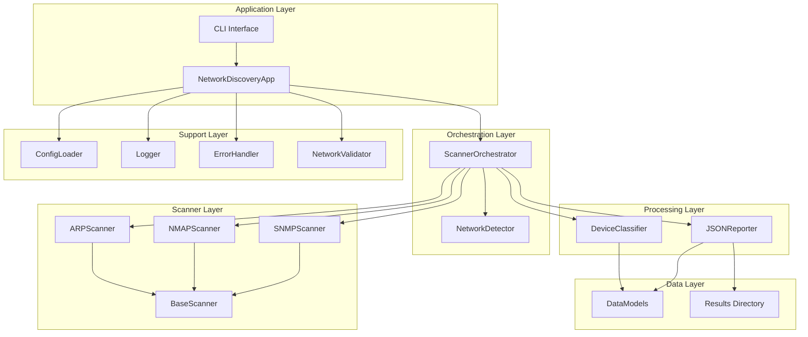
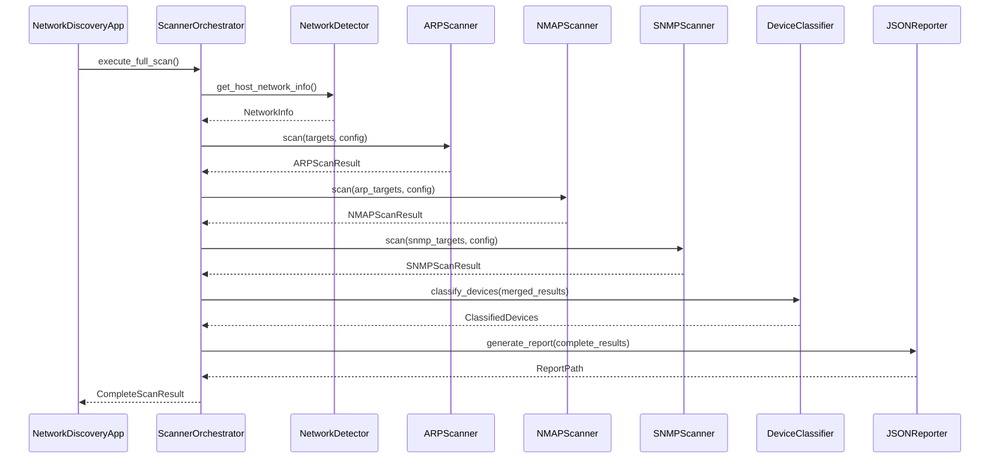
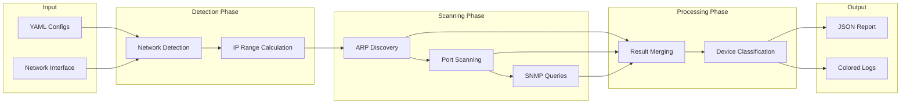
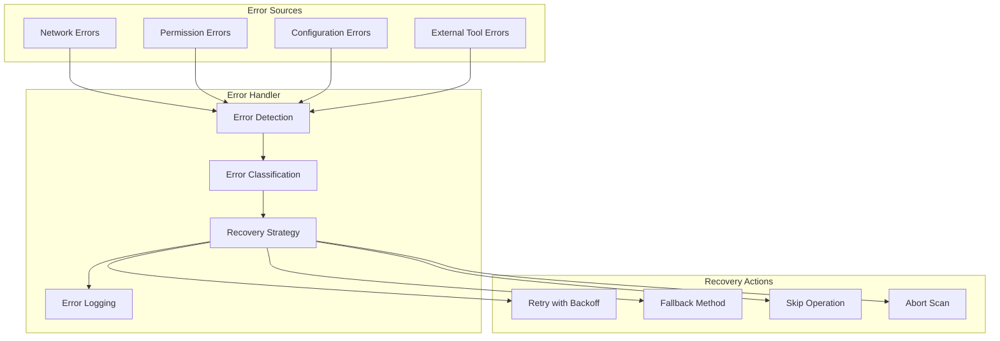
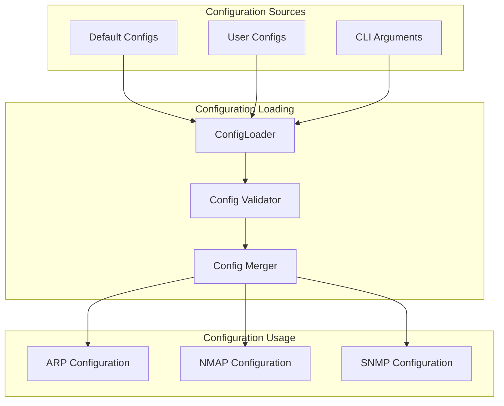

# Network Discovery Module - Architecture Documentation

## System Architecture Overview

The Network Discovery Module follows a modular, pipeline-based architecture that separates concerns and enables easy testing and maintenance.

### High-Level Architecture

### Component Responsibilities

#### Application Layer
- **CLI Interface**: Command-line argument parsing and user interaction
- **NetworkDiscoveryApp**: Main application controller, lifecycle management

#### Orchestration Layer
- **ScannerOrchestrator**: Coordinates the scanning pipeline, manages data flow
- **NetworkDetector**: Auto-detects network configuration and calculates scan ranges

#### Scanner Layer
- **BaseScanner**: Abstract interface defining scanner contract
- **ARPScanner**: Discovers active devices using ARP protocol
- **NMAPScanner**: Performs port scanning and OS detection
- **SNMPScanner**: Queries SNMP-enabled devices for detailed information

#### Processing Layer
- **DeviceClassifier**: Categorizes devices based on collected information
- **JSONReporter**: Generates structured output reports

#### Support Layer
- **ConfigLoader**: Loads and validates YAML configurations
- **Logger**: Provides colored, structured logging
- **ErrorHandler**: Centralized error handling and recovery
- **NetworkValidator**: Validates network connectivity and permissions

#### Data Layer
- **DataModels**: Type-safe data structures for all system entities
- **Results Directory**: File system storage for generated reports

## Detailed Component Design

### Scanner Pipeline Architecture

### Data Flow Architecture

### Error Handling Architecture

## Design Patterns Used

### 1. Strategy Pattern
- **Scanner Interface**: Different scanning strategies (ARP, NMAP, SNMP) implement common interface
- **Configuration Loading**: Different config formats can be supported through common interface

### 2. Pipeline Pattern
- **Scanning Pipeline**: Sequential execution of ARP → NMAP → SNMP with data passing
- **Data Processing**: Raw results → Parsed results → Classified results → Report

### 3. Observer Pattern
- **Logging System**: Components notify logger of events and progress
- **Error Handling**: Components notify error handler of exceptions

### 4. Factory Pattern
- **Scanner Creation**: Scanners are created based on configuration
- **Report Generation**: Different report formats can be created through factory

### 5. Command Pattern
- **CLI Interface**: Command-line arguments encapsulated as commands
- **Scanner Operations**: Each scan operation encapsulated as executable command

## Configuration Architecture

### Configuration Hierarchy

### Configuration Precedence
1. **CLI Arguments** (highest priority)
2. **User Configuration Files**
3. **Default Configuration Files** (lowest priority)

## Security Considerations

### Privilege Requirements
- **NMAP SYN Scans**: Require root/administrator privileges
- **Raw Socket Operations**: Require elevated permissions
- **Network Interface Access**: May require special permissions

### Security Best Practices
- **Input Validation**: All user inputs and configuration values are validated
- **Error Information**: Sensitive information is not exposed in error messages
- **Network Isolation**: Scans are limited to local network segments
- **Rate Limiting**: Built-in delays prevent network flooding

## Performance Characteristics

### Scalability Factors
- **Network Size**: Linear scaling with number of IP addresses
- **Parallel Operations**: Configurable parallelism for different phases
- **Memory Usage**: Bounded by device count and SNMP data volume
- **CPU Usage**: Moderate during active scanning phases

### Optimization Strategies
- **Parallel Scanning**: Multiple threads for ARP and NMAP operations
- **Efficient Data Structures**: Minimal memory footprint for device data
- **Lazy Loading**: SNMP data loaded only when needed
- **Caching**: Network configuration cached for scan duration

## Extension Points

### Adding New Scanners
1. Implement `BaseScanner` interface
2. Add configuration schema
3. Register with `ScannerOrchestrator`
4. Add device classification rules

### Adding New Output Formats
1. Implement reporter interface
2. Add format-specific configuration
3. Register with report factory
4. Update CLI options

### Adding New Device Types
1. Extend `DeviceType` enum
2. Add classification rules to `DeviceClassifier`
3. Update output schema
4. Add documentation

## Testing Architecture

### Test Categories
- **Unit Tests**: Individual component testing
- **Integration Tests**: Component interaction testing
- **System Tests**: End-to-end workflow testing
- **Performance Tests**: Scalability and timing validation

### Test Doubles
- **Mock Scanners**: For testing without network access
- **Stub Configurations**: For testing different scenarios
- **Fake Networks**: For controlled testing environments

## Deployment Considerations

### System Requirements
- **Python 3.8+**: Core runtime requirement
- **External Tools**: nmap, arping (optional)
- **Network Access**: Local network scanning permissions
- **File System**: Write access for configuration and results

### Installation Methods
- **Package Installation**: pip install from requirements.txt
- **Standalone Deployment**: Self-contained directory structure
- **Container Deployment**: Docker image with all dependencies

### Configuration Management
- **Default Configurations**: Shipped with reasonable defaults
- **Environment-Specific**: Override defaults for different environments
- **Version Control**: Configuration files can be version controlled