# Network Discovery Module - Workflow Documentation

## Complete Scan Workflow

This document describes the detailed workflow of the Network Discovery Module, from initialization to final report generation.

### Overview Workflow Diagram

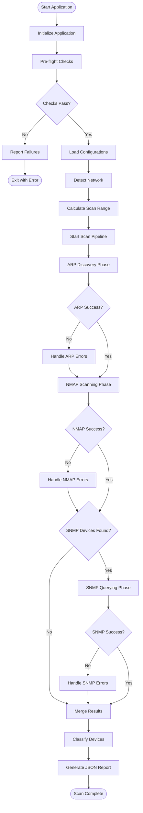

## Phase 1: Application Initialization

### 1.1 Startup Sequence

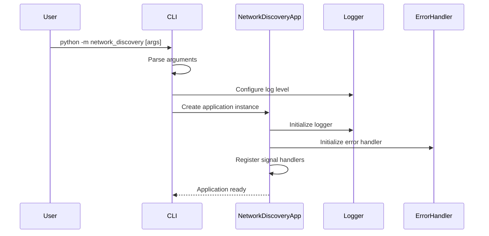

### 1.2 Signal Handler Registration

The application registers handlers for graceful shutdown:
- **SIGINT** (Ctrl+C): Graceful shutdown with cleanup
- **SIGTERM**: Graceful shutdown for process management

### 1.3 Argument Processing

Command-line arguments are processed and validated:
- Configuration directory path validation
- Output directory creation/validation
- Logging level configuration
- Feature flags (skip-checks, skip-arp, etc.)

## Phase 2: Pre-flight Checks

### 2.1 Pre-flight Check Workflow

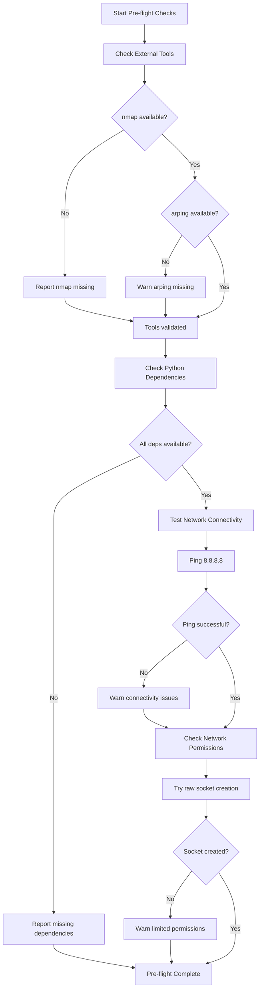

### 2.2 Tool Validation Details

#### External Tool Checks
1. **nmap**: Required for port scanning
   - Check if executable exists in PATH
   - Verify version compatibility
   - Test execution permissions
   
2. **arping**: Optional for ARP scanning
   - Check availability
   - Fallback to scapy if missing
   - Test execution permissions

#### Python Dependency Checks
Required packages validated:
- `colorama`: For colored console output
- `yaml`: For configuration file parsing
- `pysnmp`: For SNMP operations
- `scapy`: For network packet operations

#### Network Permission Checks
- Raw socket creation (requires elevated privileges)
- Regular socket creation (basic network access)
- Interface enumeration capabilities

## Phase 3: Configuration Loading

### 3.1 Configuration Loading Workflow

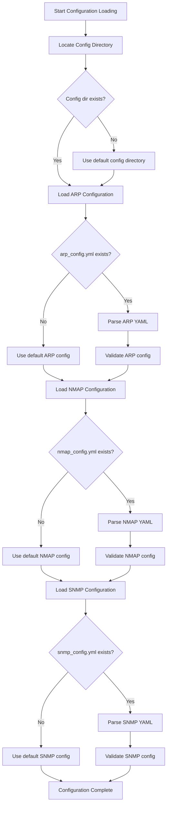

### 3.2 Configuration Validation

Each configuration file is validated for:
- **Syntax**: Valid YAML format
- **Schema**: Required fields present
- **Values**: Reasonable ranges and types
- **Dependencies**: Compatible settings across configs

## Phase 4: Network Detection

### 4.1 Network Detection Workflow

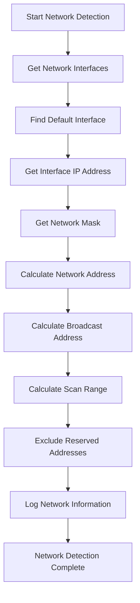

### 4.2 Address Exclusion Logic

The following addresses are automatically excluded from scanning:
- **Network Address**: First address in subnet (e.g., 192.168.1.0/24)
- **Broadcast Address**: Last address in subnet (e.g., 192.168.1.255/24)
- **Host Address**: The scanning machine's IP address
- **Reserved Ranges**: Any configured exclusion ranges

### 4.3 Network Information Logging

Detected network information is logged:
```
Network Detection Results:
├── Interface: eth0
├── Host IP: 192.168.1.100
├── Network: 192.168.1.0/24
├── Scan Range: 192.168.1.1-192.168.1.254
└── Excluded: 192.168.1.0, 192.168.1.100, 192.168.1.255
```

## Phase 5: ARP Discovery Phase

### 5.1 ARP Scanning Workflow

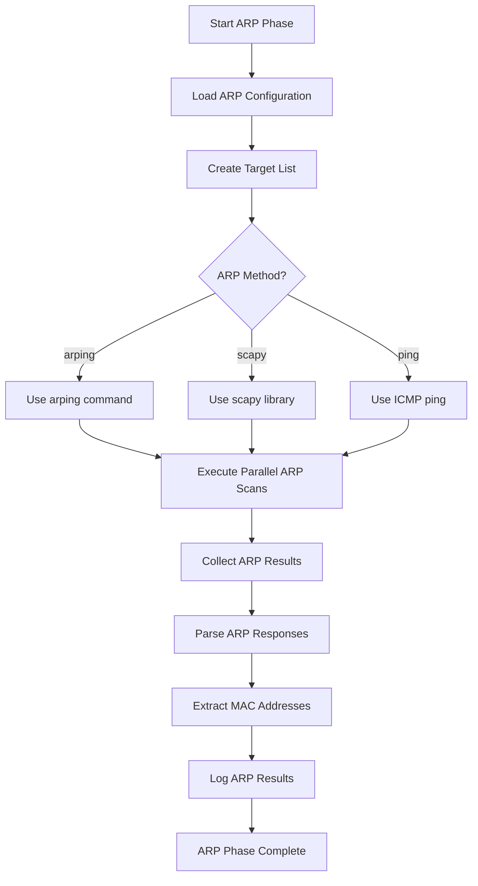

### 5.2 ARP Scanning Methods

#### Method 1: arping Command
- Executes external `arping` command
- Fastest and most reliable
- Requires arping tool installation
- May need elevated privileges

#### Method 2: scapy Library
- Pure Python implementation
- Cross-platform compatibility
- No external dependencies
- Slightly slower than arping

#### Method 3: ICMP Ping (Fallback)
- Uses standard ping command
- Most compatible method
- Less accurate (devices may not respond to ping)
- No MAC address information

### 5.3 Parallel Processing

ARP requests are processed in parallel using thread pools:
- Configurable thread count
- Rate limiting to prevent network flooding
- Timeout handling for non-responsive targets
- Retry logic for failed requests

## Phase 6: NMAP Scanning Phase

### 6.1 NMAP Scanning Workflow

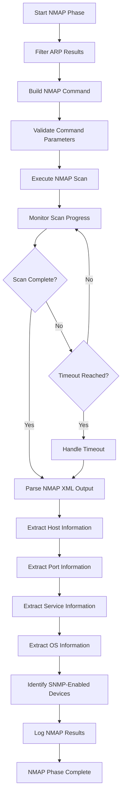

### 6.2 NMAP Command Construction

The NMAP command is built dynamically from configuration:

```bash
nmap -sS -F -T4 -O -sV --script=banner -oX output.xml target1 target2 ...
```

Components:
- **Scan Type** (`-sS`): TCP SYN scan
- **Port Range** (`-F`): Fast scan (top 100 ports)
- **Timing** (`-T4`): Aggressive timing
- **OS Detection** (`-O`): Operating system fingerprinting
- **Service Detection** (`-sV`): Service version detection
- **Scripts** (`--script=banner`): Additional information gathering
- **Output Format** (`-oX`): XML output for parsing

### 6.3 Result Parsing

NMAP XML output is parsed to extract:
- **Host Status**: Up/down status for each target
- **Open Ports**: List of accessible ports per host
- **Services**: Service names and versions
- **Operating System**: OS fingerprinting results
- **SNMP Detection**: Devices with port 161 open

## Phase 7: SNMP Querying Phase

### 7.1 SNMP Scanning Workflow

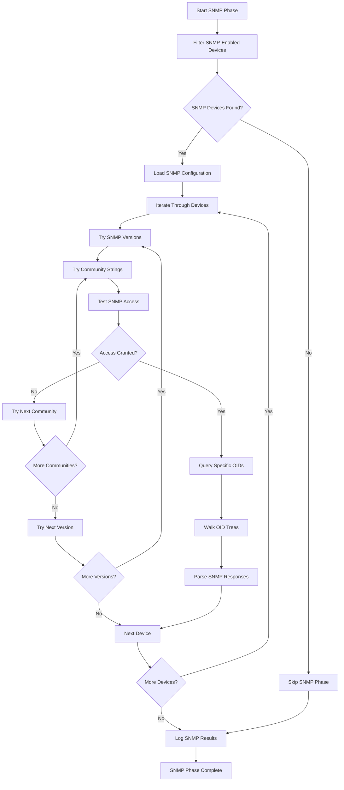

### 7.2 SNMP Access Testing

For each device with port 161 open:

1. **Version Testing**: Try SNMP versions in configured order (v2c, v1)
2. **Community Testing**: Try community strings in configured order
3. **Access Validation**: Perform test query to validate access
4. **Timeout Handling**: Respect configured timeouts and retries

### 7.3 SNMP Data Collection

#### Specific OID Queries
Individual OIDs are queried for essential information:
- System description (1.3.6.1.2.1.1.1.0)
- System name (1.3.6.1.2.1.1.5.0)
- System location (1.3.6.1.2.1.1.6.0)
- Interface count (1.3.6.1.2.1.2.1.0)

#### OID Tree Walking
Complete subtrees are walked for comprehensive data:
- System information tree (1.3.6.1.2.1.1)
- Interface information tree (1.3.6.1.2.1.2)
- IP information tree (1.3.6.1.2.1.4)

## Phase 8: Result Processing

### 8.1 Result Merging Workflow

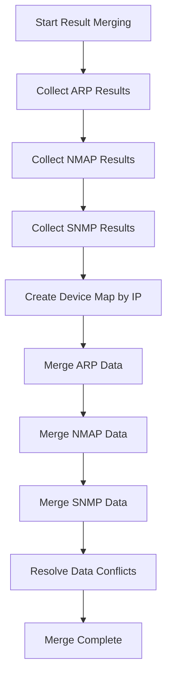

### 8.2 Device Classification Workflow

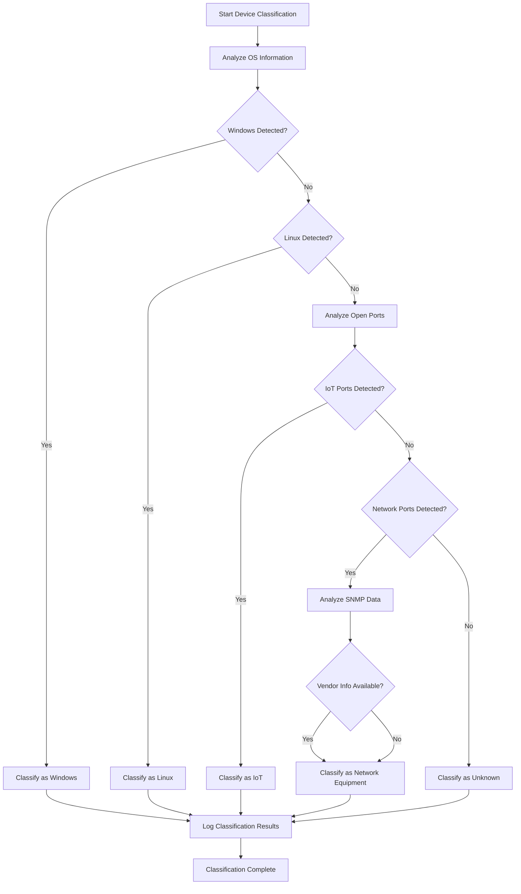

### 8.3 Classification Rules

#### Windows Detection
- OS fingerprint contains "Windows"
- Common Windows ports: 135, 139, 445, 3389
- Windows-specific services detected

#### Linux Detection
- OS fingerprint contains "Linux"
- Common Linux ports: 22 (SSH), 80/443 (web services)
- Unix-like service signatures

#### IoT Device Detection
- Common IoT ports: 1883 (MQTT), 5683 (CoAP), 8080 (web interface)
- Embedded system signatures
- Limited service profiles

#### Network Equipment Detection
- SNMP data contains network vendor information
- Network management ports: 161 (SNMP), 23 (Telnet), 80/443 (web management)
- Router/switch specific OIDs in SNMP data

## Phase 9: Report Generation

### 9.1 Report Generation Workflow

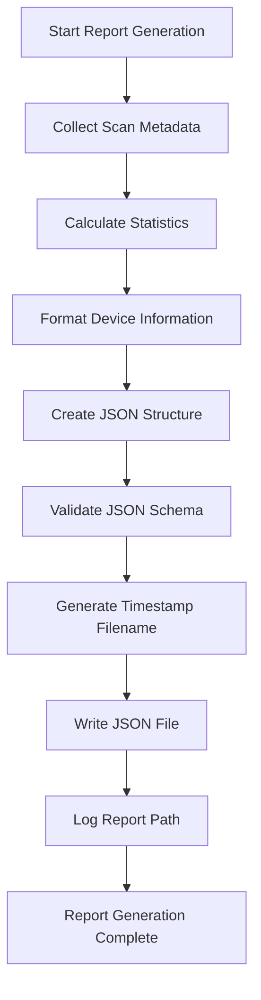

### 9.2 Report Structure

The final JSON report contains:

#### Scan Metadata
- Timestamp and duration
- Network configuration
- Scan parameters used
- Success/failure status

#### Scan Statistics
- Total addresses scanned
- Devices found per phase
- Timing information
- Error counts

#### Device Information
- Complete device profiles
- Classification results
- All collected data (ARP, NMAP, SNMP)
- Confidence scores

### 9.3 File Naming Convention

Reports are saved with timestamp-based names:
```
network_discovery_YYYYMMDD_HHMMSS.json
```

If a file with the same timestamp exists, a counter is appended:
```
network_discovery_YYYYMMDD_HHMMSS_001.json
```

## Error Handling Throughout Workflow

### Error Categories

1. **Network Errors**: Connection timeouts, unreachable hosts
2. **Permission Errors**: Insufficient privileges for operations
3. **Configuration Errors**: Invalid or missing configuration
4. **Tool Errors**: External tool failures or missing tools

### Recovery Strategies

1. **Retry with Backoff**: For transient network errors
2. **Fallback Methods**: Alternative scanning methods when primary fails
3. **Graceful Degradation**: Continue with partial results when possible
4. **User Guidance**: Provide actionable error messages and solutions

### Logging Throughout Workflow

Each phase logs:
- **Progress Information**: Current operation and completion percentage
- **Success Messages**: Successful operations and results
- **Warning Messages**: Non-critical issues and fallback actions
- **Error Messages**: Failures with detailed context and suggestions

The logging system uses color coding for easy visual parsing:
- 🟢 **Green**: Success and progress
- 🟡 **Yellow**: Warnings and non-critical issues
- 🔴 **Red**: Errors and failures
- 🔵 **Blue**: Informational messages
- 🟣 **Cyan**: Debug information (verbose mode)